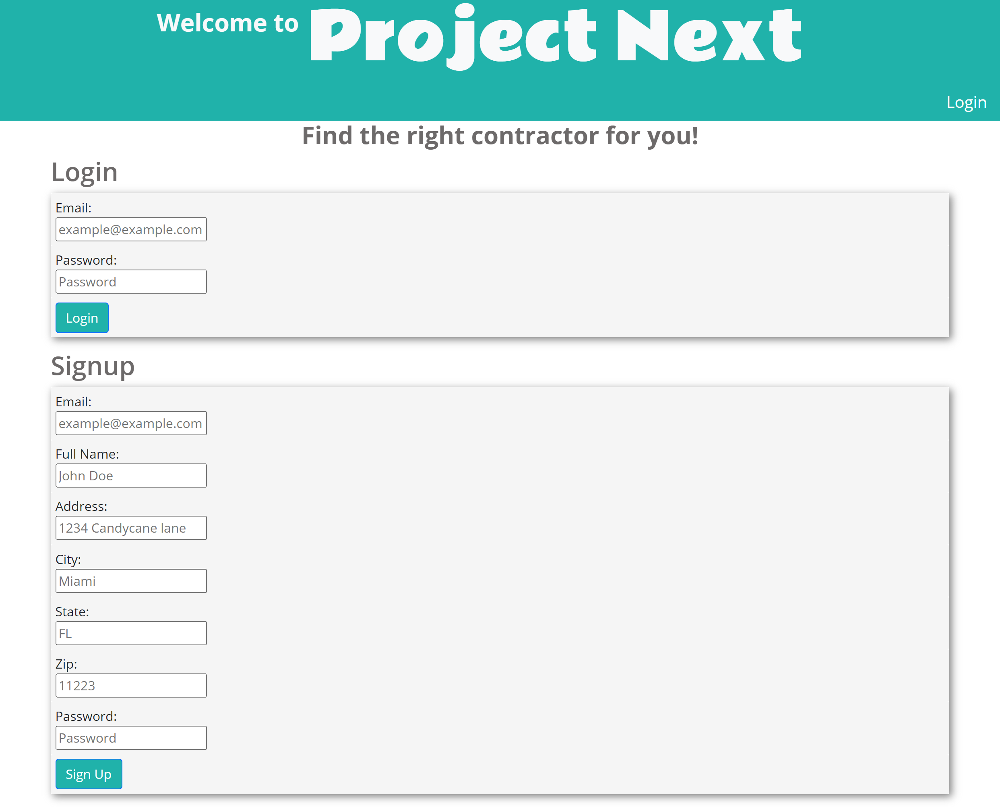
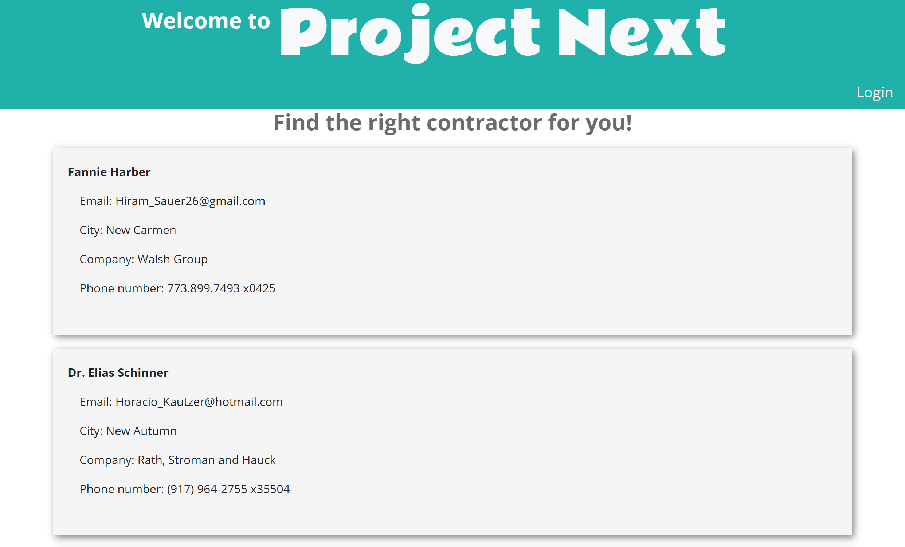
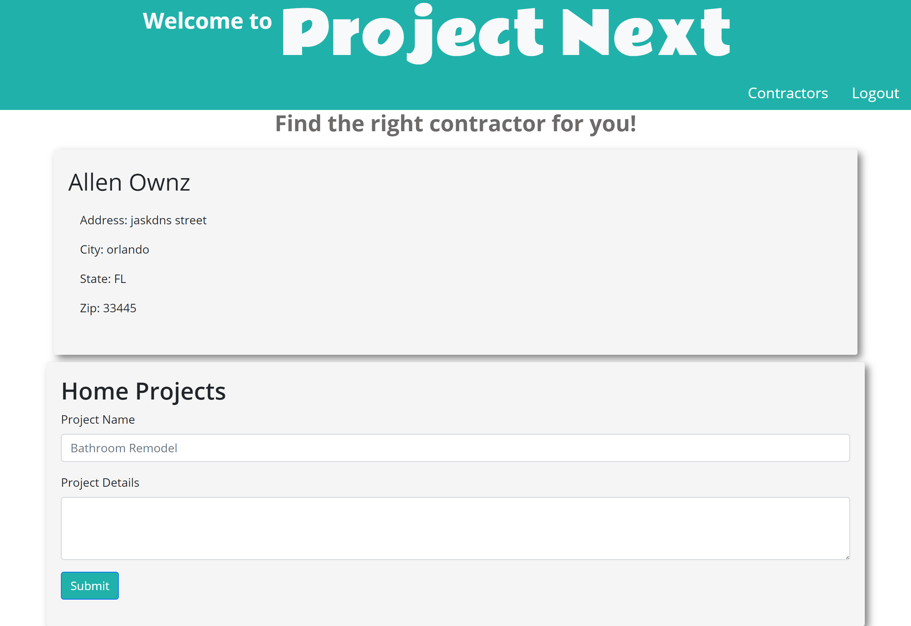

# Project-Next 

https://github.com/dthompasionas/Project-Next

https://project-next.herokuapp.com/

# Description
This full-stack application allows current homeowners to link up with local contractors to ease the home-flipping process. Homeowners can login to add their home address to the site and create home projects they want completed. Contractors can then see these projects and pick up projects they want, creating a relaxed flow of home restoration

# Table of Contents
* [License](#license) 
* [Installation](#installation)
* [Tests](#tests)
* [Usage](#usage)
* [Contribute](#contribute)
* [Questions](#questions)

# License 
This project is licensed with a MIT license.

# Installation
The following necessary dependencies are required to run this app: Mysql, express, express-session, sequelize, .env 

# Tests
The following command is needed to run test: npm test, node server.js

# Usage
Use this base login to view functionality email: example@example.com Password: bigpassword OR create your own login.

# Contribute
Contributions for this project came from Dthompasionas, Panicor, Avaniw, and JulioPlaceres

# Screenshot:

# Questions
Contact me with any questions here:

*Github: dthompasionas, Panicor, Avaniw, JulioPlaceres

*email: dthompasionas@gmail.com 
